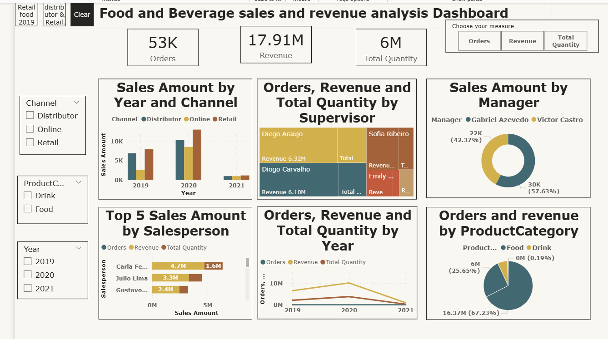

Food & Beverage Sales & Revenue Analysis (Power BI)
* Dashboard Preview:

* About This Project:

This project is a Power BI dashboard built to analyze sales performance for a Food & Beverage business.

The goal was to turn raw data into clear, actionable insights by looking at sales across different channels, products, managers, and time periods.

* What This Dashboard Shows:

Overall business performance (Orders, Revenue, Quantity)

Sales trends across multiple years

Channel-wise performance (Distributor, Online, Retail)

Manager and salesperson performance

Product category contribution (Food vs Drink)

* Key Insights:

Retail channel generates the highest revenue

2020 shows peak performance compared to other years

Food category dominates sales over drinks

Some supervisors and salespersons consistently outperform others

* Features:

Interactive filters for:

Channel (Distributor, Online, Retail)

Product Category (Food, Drink)

Year (2019–2021)

Drill-down capability for deeper analysis

KPI cards for quick business overview

Visuals including bar charts, pie charts, and trend lines

Key Influencers visual for deeper insights

* Tools Used:

Power BI

DAX (for calculations and KPIs)

Excel / CSV (data source)

* Files in This Repository:

Sales Analysis.pbix – Power BI report

Sales & Revenue Analysis.png – Dashboard preview

* How to Use:

Download the .pbix file

Open it using Power BI Desktop

Use filters and visuals to explore the dashboard

* About Me:

I’m building projects in Data Analytics and Power BI to develop practical, real-world skills in data visualization and storytelling.
